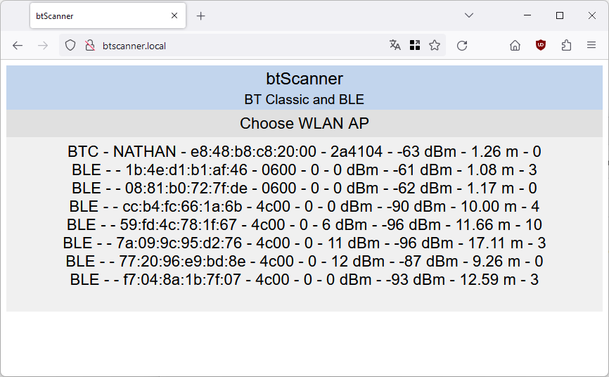

# btScanner
ESP32 based BT Scanner for BT Classic and BLE
#### Features
* calculates the distance from rssi and txpower
* bases on ESP32 Arduino core library BT classes only
* controllable via WebUI
* works as WLAN client and AP (AP chooser included)
* WebUI with IP address 192.168.4.1
* mDNS hostname btScanner.local
* DNS hostname btScanner.local (WLAN AP mode only)
#### Web UI
